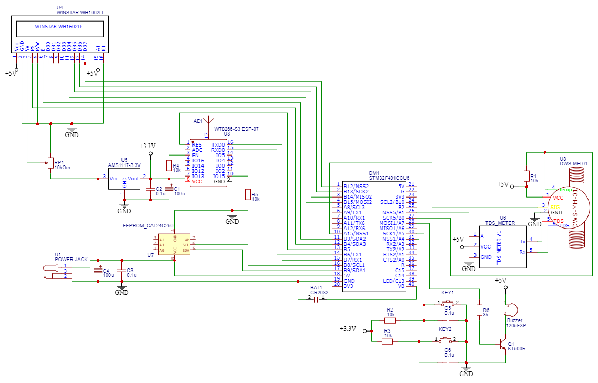

# STM32 based device, that measure utilisation of 10" water filters

Device receives data from 3in1 sensor DWS-MH-01, measure temperature, TDS level and water flow through a 10" 3-stages water filter. Volume of consumed water is calculated for each filter separately.
All the metrics are displayed on 2x16 LCD display and published via MQTT to HomeAssistant and can be used for notification about filter replacement necessity (this logic is on HA side).
As far as we have TDS metric, replacement of softener filter can be alarmed by quality of water after the filter).

Two hardware buttons are used for resetting Filter1, Filter2 and Filter3 consumption after replecament.

# Used modules

* BlackPill STM32F401 microcontroller
* 3in1 DWS-MH-01 water sensor from Aliexpress
* 2x16 LCD display (like WINSTAR WH1602D)
* AT24C256 EEPROM for backup of filter consumptions values
* AMS1117 Linear Voltage Regulator for powering ESP8266 module
* ESP-07 Wi-Fi module
* CR2032 battery holder for powering VBAT pin

# Some features

* 8x Hardware Timers are used for callback measure, display and publish procedures
* **robtillaart/RunningAverage** filters fake values from temperature sensor
* Since, consumption of water are long-term metrics here (months), actual value are stored in external EEPROM (once in a hour) and STM32 backup registry (every 10 min).
* Auto-discovery is used for automatic configuration of sensor in HomeAssistant and grouping them in a single device entity
* Although it is ESP8266 1MB moudle, firmware with AT 2.2.0 commands is used from **CytronTechnologies/esp-at-binaries** repository

